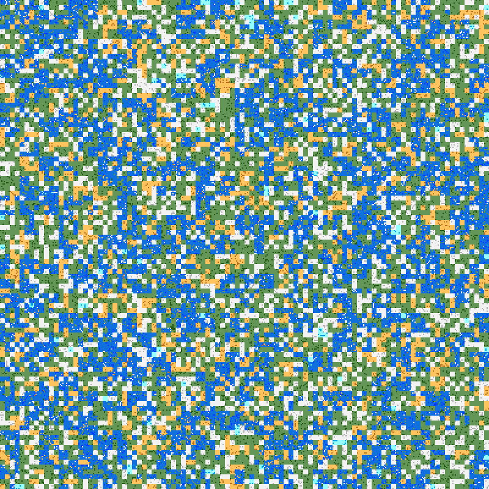

# Path\_Solver

## Description

This project is a visualization of
[dijkstra's algorithm](https://en.wikipedia.org/wiki/Dijkstra%27s_algorithm)
with an ada implementation, [gtkada](https://github.com/AdaCore/gtkada) for the GUI; and using a procedural world generation for the map.

As it is my first time using gtkAda, I extensively relied on
[the examples](https://github.com/AdaCore/gtkada/tree/master/testgtk) provided.

### World Generation

|  |
|:--:|
| *A world generated with a minecraft-like algorithm* |

#### Introduction

The first part of the project is to generate a map on which the algorithm will be able to evolve later on.
For this, I relied on the pre-existing minecraft algorithm described in [this article](https://www.alanzucconi.com/2022/06/05/minecraft-world-generation/). As such, the terminology and the description pictures' will be similar.

To generate our map, I use what I came to call the " Zooming principle ". I start with a view of the world as far aways as possible (maximum zoomed out) and progressively zoom in has I add more features. This technic is useful because it allows for a progressive creation of many details as each new map has double the number of pixels as the last.

#### Stack

The processus - the stack - is so named as it is a composition of many layers, each one having a specific instruction :

- Island : the first layer in the stack : it creates a basic map with only land and ocean in a 3 to 10 ratio.

- Zoom : Create a new map double the size from the last.

- Add_Islands : Add land to the current map.

- Init_Temperature_Z5 / Smooth_Temperature : Initilize a temperature map (matrix with value from 1 to 4) which will be used to decide which biome will goes where, and smooth it to allow for less abrupt variations.

- Remove_Too_Much_Ocean : somewhat remove lakes to make land feel less continental and much more connected.

- Place_Hills : Place (with a uniform noise) darker rocks that will (with the temperature) become elevated terrain.

- Place_Biome : Use the temperature map from earlier [1] to decide what color will the rock and rocky hills take.

The current stack I'm using can be seen below :

|  |
|:--:|
| *The current stack* |

[1] For consicion some details where omitted. In reality, the temperature map pass by a Quadruple_Map function to make the futur biomes bigger.

## Configuration

### Introduction

The project use Alire as its main compiling tool.

To install Alire, please download the [binary file](https://alire.ada.dev/) and unpack it somewhere. Then, add Alire to the path with
```export PATH="<PATH_TO_EXTRACTED>/bin/:$PATH"``` (you can make it permanent by placing this in the .profile).

### Dependency

To run, the project must use some dependencies. Apart from those below - and which can be installed in the project's folder using ```alr with <Dependency>``` - the project also use a python script. Thus, one must have python3 installed on their computer for it to properly run.

|  |
|:--:|
| *The project's dependency graph* |

### Build

To build the project, run ```alr build``` in the project folder, or
alternatively ```alr run``` to build and execute. The generated binary file is located in ./bin and must be executed here.

There is currently to binaries associated with the project :
- path_solver : the main program visualizing Dijkstra's algorithm
- generation_main : the program that creates the procedural map. It is a test file for developpement. Its result can be seen on the last layer (layer 6) in [layer/templates](./layer_templates/).


