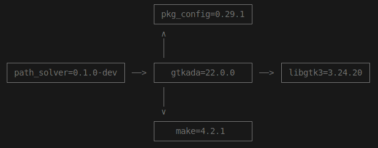

# Path\_Solver

## Description

This project is a visualization of
[dijkstra's algorithm](https://en.wikipedia.org/wiki/Dijkstra%27s_algorithm)
with an ada implementation and [gtkada](https://github.com/AdaCore/gtkada) for
the GUI.
However, the algorithm implementation is not the only thing that this project
has going on, as it has also a map generator integrated into it; meaning that
the environnement in which the algorithm will evolve is not static and is
dynamically generated.

As it is my first time using gtkAda, I extensively relied on
[the examples](https://github.com/AdaCore/gtkada/tree/master/testgtk) provided.

## Binary

A binary of the project is provided in the ./bin folder

## Configuration (in case you want to modify it)

### Introduction

The project use Alire as its main compiling tool.

To install Alire, please download the [binary file](https://alire.ada.dev/) and
unpack it somewhere. Then, add Alire to the path with
```export PATH="<PATH_TO_EXTRACTED>/bin/:$PATH"``` (you can make it permanent
by placing this in the .profile).

Do not forget to run ```alr with gtkada``` in order to add gtkada as a dependency.

|  |
|:--:|
| *The project's dependency graph* |

### Build

To build the project, run ```alr build``` in the project folder, or
alternatively ```alr run``` to build and execute. The generated binary file is
located in ./bin.


