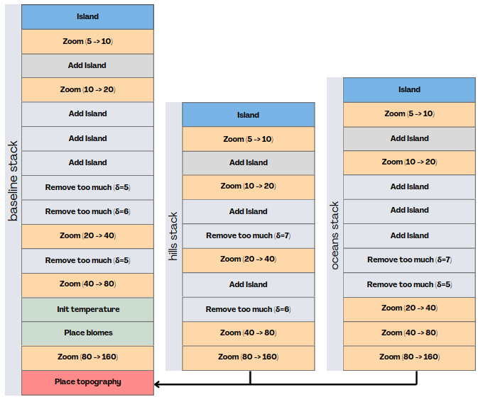
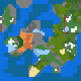
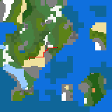
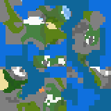
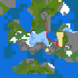

# Path\_Solver

## Description

This project is a visualization of
[dijkstra's algorithm](https://en.wikipedia.org/wiki/Dijkstra%27s_algorithm)
with an ada implementation ([gtkada](https://github.com/AdaCore/gtkada) for the GUI) and using a procedural world generation for the map.

As it is my first time using gtkAda, I extensively relied on
[the examples](https://github.com/AdaCore/gtkada/tree/master/testgtk) provided.

## Configuration

### Introduction

The project use Alire as its main compiling tool.

To install Alire, please download the [binary file](https://alire.ada.dev/) and unpack it somewhere. Then, add Alire to the path with\
```export PATH="<PATH_TO_EXTRACTED>/bin/:$PATH"``` (you can make it permanent by placing this in the .profile).

### Dependency

To run, the project must use some dependencies. To install them using alire, please run the command\ ```alr with <Dependency>```.
The graph of all the project's dependencies can be found below.

|  |
|:--:|
| *The project's dependency graph* |

### Build

To build the project, run ```alr build``` in the project folder, or
alternatively ```alr run``` to build and execute. The generated binary file is located in ./bin and must be executed here.

There is currently to binaries associated with the project :
- path_solver : the main program visualizing Dijkstra's algorithm
- generation_main : the program that creates the procedural map. It is a test file for developpement purposes. Its result can be seen on the last layer in [layer/templates](./layer_templates/).

## Project's details and implementation choices.

### World Generation

    \
   \
*160x160 worlds generated with a minecraft-like algorithm*

#### Introduction

The first part of the project is to generate a map on which the algorithm will be able to evolve later on.
For this, I relied on the pre-existing minecraft algorithm described in [this article](https://www.alanzucconi.com/2022/06/05/minecraft-world-generation/). As such, the terminology and the description pictures' will be similar.

To generate our map, I use what I came to call the " Zooming principle ". I start with a view of the world as far aways as possible (maximum zoomed out) and progressively zoom in as I add more features. This technic is useful because it allows for a progressive creation of many details as each new map has double the number of pixels as the last.

#### Stack

The processus - the stack - is so named as it is a composition of many layers, each one having a specific instruction :

- Island : the first layer in the stack. It creates a basic map with only rocks and ocean in a 3 to 10 ratio.

- Zoom : Create a new map double the size from the last.

- Add_Islands : Add/Erode land to the current map with the help a horizontal and a vertical image gradient.

- Init_Temperature_Z5 : Initialize a temperature map where each point has a value from 1 to 5 which represent the zone general biome. The map is generated using [perlin noise](https://en.wikipedia.org/wiki/Perlin_noise) which allows for a somewhat continuous transition and a "temperature feel" to the map [1].

- Smooth_Temperature : Smooth the temperature map for less abrupt variations using kernel image gradients.

- Remove_Too_Much : This is a [dilation / erosion operator](https://en.wikipedia.org/wiki/Mathematical_morphology#Basic_operators) (depending on what you choose to erode) that I initialy created to remove small patch of ocean (think of a 1x1 ocean in land).

- Place_Biome : Use the temperature map from earlier [2] to decide what color will the rocks take. Because of the [number of sub-biomes](./src/constants.ads (L.43 and following)), a one-to-one bijection between biome and temperature number is impossible. As such, each sub-biome has a probability of being choosen and is then placed into the zone by a [diffusion process (L.467 and following (sub-functions above))](./src/model/generation/generation.adb).

- Place_Topography : Using the same general algorithm as the [Generate_Baseline function (L.462)](./src/model/generation/generation.adb), it creates a general map
for the ocean and the hills that are then placed on top of the previous layer.

The current stack I'm using can be seen below (it _is_ a bit simplified) :

|  |
|:--:|
| *The current stack* |

[1] Just like for forecast map in the news !\
[2] Some details where omitted. In reality, the temperature map pass by a Scale_Map function to make the futur biomes bigger.

### dijkstra's algorithm

    \
   \
*Dijkstra's algorithm visualization. Notice how the third map has no path as both ending points are on different islands.*

#### Introduction

The second part of this project was to implement dijkstra's algorithm and let it evolve in the previous kind of environment. The algorithm can be found [here](<https://en.wikipedia.org/wiki/Dijkstra%27s_algorithm>) and I won't be going into details about it. However, what I will do is summarize the implementation.

While I could have implemented a faster algorithm with the use of heaps (see the wikipedia article above), I prefered to opt for a simpler version, at least on a first basis. As I understood it better, it would be more convinent to implement, and what's more, if it were already fast enough (which it is), I would not need to go far and beyond my current efforts.

#### Costs

To implement the costs of each environment pixel, I decided to go for a hash map instead of a cost map. This has the advantage of being scalable. Indeed, the hash map is O(1) in memory because it stay the same whatever the size of the map is. Moreover, it is [O(log (N))](<https://learn.adacore.com/courses/intro-to-ada/chapters/standard_library_containers.html#hashed-maps>) in average in access time, which is probably faster than a 2D matrix. For more details about the hash function see [here](./src/model/map_model/dijkstra_model.ads).

The costs of each pixel's traversal was calculated with two variables in mind : The climate temperature and the speed. As an exemple, a forest is more difficult to traverse than a desert, but it has a lower temperature.
Moreover, the temperature part of the cost must be quadratic : in both extremes, the cost is the same. On the other hand, the speed is linear. The more difficult the terrain, the slower the traversal is. Finally, a hill terrain slightly makes the cost go up whatever the original terrain. As such, for a temperature and speed (x, y), the associated cost is :

``` C(x, y) = aT(x) + bS(y)```\
with\
```T(x) = x^2 + 1, S(x) = x, a = 1, b = 1/2```

#### Prev, Queue and all dijkstra's containers

Dijkstra's algorithm use a few lists to store vertices and costs. For both the Cost, the previous and the queue containers, I opted for a NxN list with each element representing a pixel on the map. This way, I could, for :
- The cost : Place INFINITY on cases where there was (Deep) Ocean
- The Previous : Place -1 on pixels not visited
- The Queue : Place 1 for pixel on the queue, 0 on those not in it.

The queue, being a bit special, is to be more discussed about.
The queue is a NxN+1 list of Integers. It has the value 1 if a pixel is in the queue, 0 if not. The last element of the queue is the number of elements still in the queue.\
For the queue, I decided for an array instead of a vector because it allowed for a faster neighbours search. If I had used a vector, I would have had a O(CM.N) in time (N is the queue size, M the size until we reach a neighbour, M <= N and C is the number of neighbours to search for) while I could here have a O(1).
However, this has the downside of having a O(N) [1] for the search of the minimum, instead of a O(1) for the vector implementation.

[1] With my current implementation.


